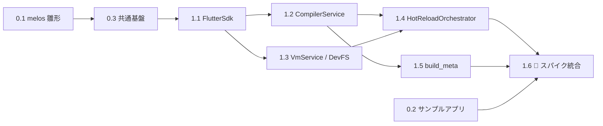
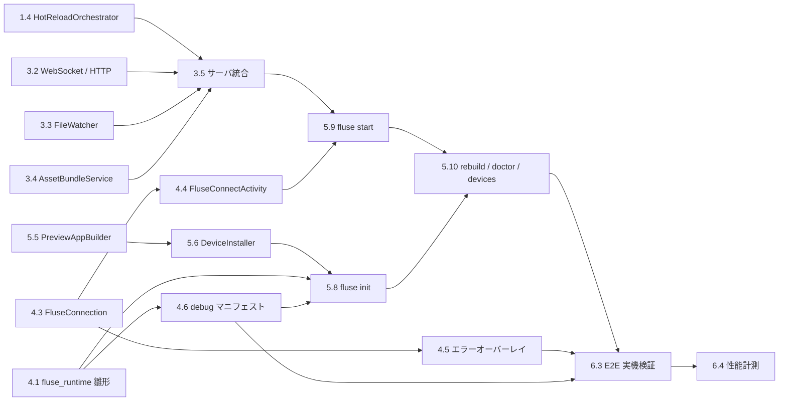

# タスクリスト - fluse (Flutter Preview Client) Phase1

## 概要

- **総タスク数**: 43
- **推定作業時間**: 約 150–180時間（20–24人日）
- **優先度**: 高
- **前提**: `.tmp/requirements.md` v0.2 / `.tmp/design.md`
- **スコープ**: Phase1（Android実機 / Debug / WebSocket / QR接続 / Hot Reload / Asset同期）

### 分解の基本方針

1. **最大の未知＝反映経路（frontend_server → DevFS → reloadSources → reassemble）を最初に潰す。**
   Phase 1 のスパイクは `adb forward` を使い、トンネル・WebSocket・Runtime を一切作らずに実機 Hot Reload を成立させる。ここが通らなければ設計を見直すため、**Task 1.6 を GO/NO-GO ゲートとする**。

   ただし**このゲートが証明する範囲は「反映経路の実現性」に限られる**。`adb forward` で
   VM Service に直結するため、以下は Task 1.6 では一切検証されない。

   | 検証される | 検証されない |
   |---|---|
   | `frontend_server` の差分 dill 生成 | `TunnelEndpoint` / `FluseTunnel`（WS binary 中継） |
   | DevFS への PUT と `reloadSources` | 認証・ペアリング・再接続（`FluseConnection`） |
   | ビルドフラグ整合性（`build_meta`） | LAN 経由のスループットとレイテンシ |
   | `reassemble` による画面反映 | Runtime の常駐性・Hot Restart 耐性 |

   トンネル経路の実現性は **Task 2.5（L1統合テスト）を第2のゲート**として検証する。ここで
   10MB双方向転送のスループットが要求を満たさなければ、フレーム設計を見直す。
2. 各タスクは 1–4時間のコミット単位。テストは各タスクに内包し、最後にまとめない。
3. `fluse_protocol` を早期に確定させ、Dart側（Phase 3）と Kotlin側（Phase 4）を並行可能にする。

---

## タスク一覧

### Phase 0: 基盤整備

#### Task 0.1: melos モノレポ雛形の作成

- [ ] ルート `pubspec.yaml` に `workspace` と `melos` を定義（Melos 7 以降は `melos.yaml` 廃止・pub workspaces 統合）
- [ ] `packages/fluse_protocol` / `fluse_builder` / `fluse_server` / `fluse_cli` / `fluse_runtime` の空パッケージを生成し、各々に `resolution: workspace` を設定
- [ ] 各パッケージの `analysis_options.yaml` を共通化（`package:lints/recommended.yaml` + 独自ルール）
- [ ] `melos bootstrap` / `melos run analyze` / `melos run test` スクリプトを定義
- [ ] `.gitignore` を整備（`.dart_tool/`, `.flutter_preview/`, `build/`。ルート `pubspec.lock` は追跡する）
- **完了条件**: ルート `pubspec.yaml` の `workspace` + `melos` 構成で `melos bootstrap && melos run analyze` が全パッケージで警告0で通る
- **依存**: なし
- **推定時間**: 2h

#### Task 0.2: 検証用サンプルアプリの作成

- [ ] `examples/counter_app` に `flutter create` で最小アプリを生成
- [ ] assets（画像1点）と font を宣言し、asset同期の検証対象にする
- [ ] Native Plugin を1つ含める（`path_provider` 等）ことでプラグイン解決経路も検証対象にする
- [ ] `flutter build apk --debug` が通ることを確認
- **完了条件**: サンプルアプリが実機で起動し、asset とプラグインが動作する
- **依存**: なし（0.1 と並行可）
- **推定時間**: 1h

#### Task 0.3: 共通基盤（ProcessManager 抽象・Logger）

- [ ] `fluse_server` に `ProcessManager` インターフェースと実装・モックを定義
- [ ] 構造化ログ（JSON Lines）を出力する `FluseLogger` を実装
- [ ] トークンを常にマスクする `redact()` を実装しテストを書く（設計 §6.1）
- **完了条件**: 外部プロセス呼び出しが全てモック可能。`redact()` のテストが通る
- **依存**: Task 0.1
- **推定時間**: 2h

---

### Phase 1: 中核経路の検証（最優先・クリティカルパス）

> このフェーズの目的は**動くものを作ること**ではなく、**設計が成立することを証明すること**。
> トンネル・WebSocket・Runtime は一切実装しない。

#### Task 1.1: FlutterSdk 解決の実装

- [ ] `FlutterSdk.resolve()` を実装（PATH / `FLUSE_FLUTTER_SDK` / `--flutter-sdk` の優先順位）
- [ ] `version` / `revision` / `dartVersion` を取得（`flutter --version --machine` を使用）
- [ ] `dartAotRuntime` / `frontendServerSnapshot` / `patchedSdkRoot` のパス解決（ホストプラットフォーム分岐を含む）
- [ ] 各パスの存在検証と、欠損時の明確なエラーメッセージ
- **完了条件**: ローカルの Flutter 3.41.9 に対し全パスが解決でき、存在検証が通る。SDK未検出時のテストが通る
- **依存**: Task 0.3
- **推定時間**: 3h

#### Task 1.2: CompilerService の実装（frontend_server 駆動）

- [ ] プロセス起動コマンドの組み立て（設計 §2.2.3(a) の全フラグ）
- [ ] stdin プロトコル `compile` / `recompile` / `accept` / `reject` / `quit` の送信
- [ ] stdout パーサ（`result <boundaryKey>` … `<boundaryKey> <outputPath> <errorCount>`）
- [ ] `DiagnosticEntry`（file / line / col / severity / message）の抽出
- [ ] `boundaryKey` の生成と多重リクエストの直列化
- [ ] stderr の転送とプロセス異常終了の検出
- **完了条件**: 実 `frontend_server` に対し `examples/counter_app` を compile → 意図的な構文エラーを入れて recompile し、`errorCount` と診断内容が期待通りになる単体テストが通る
- **依存**: Task 1.1
- **推定時間**: 4h

#### Task 1.3: VmServiceClient と DevFSClient の実装

- [ ] `package:vm_service` で VM Service へ接続し、メイン isolate を特定する
- [ ] `createDevFS` / `deleteDevFS` RPC のラッパ
- [ ] DevFS への HTTP PUT（`dev_fs_name` / `dev_fs_uri_b64` ヘッダ、gzip ボディ、`Accept-Encoding` 削除）
- [ ] 同時実行3固定・60秒タイムアウト・最大10回リトライ（設計 §8.2-4）
- [ ] `reloadSources(isolateId, rootLibUri:)` と `ext.flutter.reassemble` / `ext.flutter.evict` のラッパ
- **完了条件**: ヘッダ生成・gzip・リトライの単体テストが通る。ダミーHTTPサーバに対し3並列で PUT されることを確認
- **依存**: Task 1.1
- **推定時間**: 4h

#### Task 1.4: HotReloadOrchestrator の実装

- [ ] 設計 §2.2.3(d) のシーケンスを実装
- [ ] `errorCount > 0` の場合は `accept`/`reject` どちらも呼ばずに中断する
- [ ] `ReloadReport.success == false` の場合に**必ず `reject()`** を呼ぶ（設計 §10-2）
- [ ] 成功時のみ `accept()` → asset `evict` → `reassemble`
- [ ] 各段の所要時間を計測してログに残す
- **完了条件**: 3経路（成功 / コンパイルエラー / reload失敗）それぞれで `accept`/`reject` の呼び出しが期待通りになるモックテストが通る
- **依存**: Task 1.2, Task 1.3
- **推定時間**: 3h

#### Task 1.5: build_meta（ビルドフラグ整合性）の実装

- [ ] `flutter build apk --debug --verbose` の出力から実際に使われた frontend_server フラグを抽出する
- [ ] `.flutter_preview/cache/build_meta.json` に保存する
- [ ] `CompilerService` 起動時に build_meta を読んでフラグを再現する
- [ ] 不一致を検出したら起動時エラーにする（設計 §10-1）
- **完了条件**: build_meta を意図的に改変すると起動が失敗し、原因が明示されることをテストで確認
- **依存**: Task 1.2
- **推定時間**: 3h

#### Task 1.6: 🚩 スパイク統合 — adb forward 経由で実機 Hot Reload を通す

> **GO/NO-GO ゲート。ここが通らない場合は設計を再検討する。**

- [ ] `examples/counter_app` を `flutter build apk --debug` してインストール・起動
- [ ] `adb logcat` から VM Service の URI を取得する（`The Dart VM service is listening on ...`）
- [ ] `adb forward tcp:0 tcp:<port>` でPCから到達可能にする
- [ ] Task 1.1–1.5 の部品を繋ぎ、`lib/main.dart` の文言変更が実機画面に反映されることを確認
- [ ] assets の差し替えが `evict` で反映されることを確認
- [ ] 反映までの所要時間を計測し、設計 §8.1 の目標（< 1.0秒）と比較する
- **完了条件**: 実機で Dart 変更・asset 変更の両方が反映される。計測結果を `.tmp/spike-result.md` に記録する
- **依存**: Task 1.4, Task 1.5, Task 0.2
- **推定時間**: 4h

---

### Phase 2: プロトコルとトンネル

#### Task 2.1: fluse_protocol（Dart）の実装

- [ ] 設計 §2.2.1 の全制御メッセージを `sealed class` で定義
- [ ] `toJson` / `fromJson` と未知 type のハンドリング
- [ ] `protocolVersion` 定数とネゴシエーション判定
- [ ] `TunnelFrame` の `encode` / `decode`
- [ ] `DiagnosticEntry` / エラーコード enum の定義
- **完了条件**: 全メッセージの round-trip テスト、不正JSON、`TunnelFrame` の境界値（0バイトpayload / streamId=0xFFFFFFFF）テストが通る。カバレッジ95%以上
- **依存**: Task 0.1
- **推定時間**: 3h

#### Task 2.2: TunnelEndpoint（サーバ側）の実装

- [ ] localhost に TCP リッスンを立て、接続ごとに streamId を採番する
- [ ] TCP → `TunnelFrame`(data) → WebSocket binary の転送
- [ ] WebSocket binary → TCP の転送
- [ ] `open` / `close` の双方向伝搬とストリーム解放
- [ ] バックプレッシャ（送信キュー4MB超でTCP読み取り一時停止、設計 §8.2-5）
- [ ] `bind()` が返す `Uri` に元の authCode を保持する
- **完了条件**: 単体テストでフレーム分割・再結合・close伝搬が検証される
- **依存**: Task 2.1
- **推定時間**: 4h

#### Task 2.3: fluse_protocol（Kotlin）の実装

- [ ] Dart 版と同一のワイヤ表現を Kotlin で手書き実装
- [ ] `TunnelFrame` の encode/decode（ByteBuffer, big-endian）
- [ ] 制御メッセージの JSON シリアライズ（`org.json` または kotlinx.serialization）
- [ ] `protocolVersion` を Dart 版と共有する仕組み（CI で突合、設計 §9.1）
- **完了条件**: Dart 版が生成したバイト列を Kotlin がデコードでき、逆も成立するクロステスト（固定バイト列のゴールデンテスト）が通る
- **依存**: Task 2.1
- **推定時間**: 3h

#### Task 2.4: FluseTunnel（Kotlin）の実装

- [ ] WebSocket binary → `Socket("127.0.0.1", vmServicePort)` への転送
- [ ] TCP → WebSocket binary への転送（streamId ごとに coroutine）
- [ ] `open` / `close` 処理とソケットのライフサイクル管理
- [ ] 接続失敗・切断時のクリーンアップ
- **完了条件**: JVM 上でローカルTCPエコーサーバに対する双方向転送のテストが通る
- **依存**: Task 2.3
- **推定時間**: 4h

#### Task 2.5: L1統合テスト — トンネル10MB双方向転送

- [ ] ダミーTCPエコーサーバを Dart で立てる
- [ ] `TunnelEndpoint`(Dart) ⇄ `FluseTunnel`(JVM) を実WebSocketで接続する
- [ ] 10MB を双方向転送し、バイト完全一致を検証する
- [ ] 複数ストリーム（4本）同時転送を検証する
- [ ] スループットを計測し設計 §8.1 の目標（> 10MB/s）と比較する
- **完了条件**: 完全一致 + 複数ストリーム同時転送が成功。計測結果を記録
- **依存**: Task 2.2, Task 2.4
- **推定時間**: 3h

---

### Phase 3: サーバ本体

#### Task 3.1: SessionManager と認証の実装

- [ ] `pairingToken` の発行（`Random.secure()` 32バイト / TTL 10分 / 1回限り）
- [ ] `deviceToken` の発行と `.flutter_preview/devices.json` への永続化
- [ ] `hello` の検証（protocolVersion / projectId / flutterRevision / appVersion / token）
- [ ] 定数時間比較の実装
- [ ] `reject` コード（AUTH_FAILED / PROJECT_MISMATCH / REVISION_MISMATCH / PROTOCOL_MISMATCH / APP_OUTDATED / TOO_MANY_DEVICES）の判定
- [ ] 2台目接続の `TOO_MANY_DEVICES` 拒否（設計 §10-10）
- **完了条件**: 各 reject コードに対する単体テスト、TTL切れ・トークン再利用の拒否テストが通る
- **依存**: Task 2.1
- **推定時間**: 4h

#### Task 3.2: WebSocket / HTTP サーバの実装

- [ ] `shelf` + `shelf_web_socket` で `/ws` `/apk` `/` `/health` を提供
- [ ] 既定でプライベートIPにのみバインド、`--host 0.0.0.0` 時は警告（設計 §6.1）
- [ ] text frame → 制御メッセージ、binary frame → トンネルへのディスパッチ
- [ ] 未認証接続からのトンネルフレームを即切断
- [ ] heartbeat（ping/pong）とタイムアウト検出
- [ ] インストール案内HTML（`/`）の生成
- **完了条件**: 未認証トンネルフレームが切断されること、heartbeat タイムアウトが検出されることをテストで確認
- **依存**: Task 3.1, Task 2.2
- **推定時間**: 4h

#### Task 3.3: FileWatcher の実装

- [ ] `package:watcher` で `lib/` と asset ディレクトリを監視（Hot Reload 対象）
- [ ] **指紋対象（設計 §2.2.2 のテーブル）も全て監視対象に含める**。`lib/` と asset だけでは
      `APP_OUTDATED` を検出できない。具体的には `pubspec.lock` / `pubspec.yaml` /
      `.flutter-plugins-dependencies` / `android/app/src/*/AndroidManifest.xml` /
      `android/**/*.gradle{,.kts}` / `gradle.properties` / `gradle-wrapper.properties` /
      `android/app/src/main/{java,kotlin,jni,res}/**`
- [ ] debounce 50ms（設計 §8.2-3、エディタの atomic write 対策）
- [ ] 変更ファイルの分類（Dartソース / asset / 指紋対象）
- [ ] 指紋対象の変更を検出したら Watch を停止し `APP_OUTDATED` を通知
- **完了条件**: atomic write を模した create/delete/modify の連発が1イベントに畳まれるテストが通る。**指紋対象の各ルート（`pubspec.lock` / Manifest / Gradle / native ソース）について、変更が `APP_OUTDATED` を発火させるテストが個別に通る**
- **依存**: Task 0.3
- **推定時間**: 3h

#### Task 3.4: AssetBundleService の実装

- [ ] `pubspec.yaml` の `flutter:` セクションから assets / fonts を解決
- [ ] `archivePath -> (size, mtime, sha256)` のキャッシュを `.flutter_preview/cache/assets.json` に保存
- [ ] 変更分のみを列挙し、DevFS上の `build/flutter_assets/<archivePath>` に写像
- [ ] `AssetManifest.json` / `FontManifest.json` の再生成
- **完了条件**: asset 追加・変更・削除の各ケースで正しい差分が列挙されるテストが通る
- **依存**: Task 1.3
- **推定時間**: 4h

#### Task 3.5: サーバ統合（接続 → ready → reload）

- [ ] 設計 §3.1 の接続シーケンスを実装（hello → accept → vmServiceReady → tunnel → createDevFS → 初回同期 → ready）
- [ ] `HotReloadOrchestrator` を FileWatcher と接続
- [ ] 切断時のリソース解放（DevFS破棄 / トンネル終了 / CompilerService は維持）
- [ ] 再接続時の DevFS 再作成
- **完了条件**: モックしたクライアントで接続 → reload → 切断 → 再接続の一連が通る統合テスト
- **依存**: Task 3.2, Task 3.3, Task 3.4, Task 1.4
- **推定時間**: 4h

#### Task 3.6: エラー通知経路の実装

- [ ] 設計 §5.1 の全エラー分類を型として定義
- [ ] コンパイルエラーを CLI コンソールと `compileError` メッセージの両方へ送出
- [ ] `compileOk` によるオーバーレイ解除
- [ ] `reloadSources` の `notices` の整形表示
- [ ] `.flutter_preview/logs/` への JSON Lines 出力
- **完了条件**: 各エラー分類が CLI と App の両方に正しく届くことをモックテストで確認
- **依存**: Task 3.5
- **推定時間**: 3h

---

### Phase 4: Runtime (Android)

#### Task 4.1: fluse_runtime プラグイン雛形と Dart 側の実装

- [ ] `flutter create --template=plugin --platforms=android` で雛形を作成
- [ ] `flusePreviewMain(void Function() appMain)` を実装（`appMain()` を**先に**呼ぶ、設計 §10-5）
- [ ] `Service.getInfo()` → MethodChannel `dev.fluse/runtime#vmServiceReady`
- [ ] VM Service 無効時（`serverUri == null`）に無害に終了する
- **完了条件**: サンプルアプリに組み込み、Dart 側から VM Service URI が Native に渡ることを logcat で確認
- **依存**: Task 0.1, Task 0.2
- **推定時間**: 3h

#### Task 4.2: FluseInitProvider と FluseStore の実装

- [ ] `ContentProvider` による自動初期化（ユーザーのManifest変更を不要にする）
- [ ] `ActivityLifecycleCallbacks` の登録と最初の Activity onResume フック
- [ ] `FluseStore`（EncryptedSharedPreferences: deviceToken / lastHost / lastPort）
- [ ] `deviceId`（ANDROID_ID のハッシュ）と `deviceName` の取得
- **完了条件**: サンプルアプリ起動時に Provider が初期化され、最初の Activity で分岐が走ることを確認
- **依存**: Task 4.1
- **推定時間**: 3h

#### Task 4.3: FluseConnection の実装

- [ ] Application スコープのシングルトンとして実装（設計 §10-6）
- [ ] WebSocket 接続 → `hello` → `accept`/`reject` 処理
- [ ] `issuedDeviceToken` の保存
- [ ] 指数バックオフ再接続（1s→2s→4s→最大30s）
- [ ] heartbeat 応答
- [ ] `vmServiceReady` の冪等な再送処理（Hot Restart 対策）
- **完了条件**: モックWebSocketサーバに対し、接続・reject・切断・再接続のテストが通る
- **依存**: Task 4.2, Task 2.3
- **推定時間**: 4h

#### Task 4.4: FluseConnectActivity（QRスキャン / 手入力）の実装

- [ ] CameraX + ZXing core による QR スキャン
- [ ] CAMERA 権限のリクエストと拒否時のフォールバック
- [ ] `fluse://connect?...` のパースと検証
- [ ] ホスト・ポート・トークンの手入力フォーム（カメラ非搭載端末・エミュレータ用）
- [ ] スキャン成功 → `FluseConnection` へ委譲 → 画面を閉じる
- **完了条件**: 実機で QR スキャンと手入力の両方から接続できる
- **依存**: Task 4.3
- **推定時間**: 4h

#### Task 4.5: FluseErrorOverlay と FluseBadge の実装

- [ ] `compileError` 受信時に `WindowManager` 経由で赤画面を重畳（Dart に依存しない、設計 §5.2）
- [ ] 診断内容（file:line:col + message）の表示とスクロール
- [ ] `compileOk` で自動解除
- [ ] 画面隅の接続状態バッジ、タップで `FluseConnectActivity` を再表示
- **完了条件**: Dart がコンパイルエラーで起動できない状態でもオーバーレイが表示される
- **依存**: Task 4.3
- **推定時間**: 4h

#### Task 4.6: debug マニフェスト（cleartext / 権限）の整備

- [ ] `src/debug/AndroidManifest.xml` に INTERNET / CAMERA 権限を宣言
- [ ] `tools:replace="android:usesCleartextTraffic"` で `ws://` を許可（設計 §10-4）
- [ ] ユーザーアプリが独自 `networkSecurityConfig` を持つ場合のマージ競合を検出し、明示的なエラーメッセージを出す
- [ ] release ビルドに一切影響しないことを `flutter build apk --release` で検証
- **完了条件**: debug ビルドで `ws://` 接続が成功し、release ビルドの Manifest に fluse の痕跡がないことを `aapt dump` で確認
- **依存**: Task 4.1
- **推定時間**: 3h

---

### Phase 5: Builder と CLI

#### Task 5.1: ProjectAnalyzer の実装

- [ ] `pubspec.yaml` から `packageName` と `flutter:` セクションを解析
- [ ] `android/app/build.gradle(.kts)` から `applicationId` を抽出
- [ ] `.flutter-plugins-dependencies` から `PluginRef` 一覧を構築
- [ ] Flutter プロジェクトでない場合の `PROJECT_NOT_FLUTTER` 判定
- **完了条件**: サンプルアプリと非Flutterプロジェクトの両方で期待通りの結果になるテストが通る
- **依存**: Task 1.1
- **推定時間**: 3h

#### Task 5.2: Fingerprint の実装

- [ ] 設計 §2.2.2 の指紋テーブル全8キーを実装
- [ ] `android.native` はパス+mtime+size の一次判定 → 一致時は内容ハッシュを省略（設計 §8.2-7）
- [ ] `.flutter_preview/cache/fingerprint.json` の保存・読込
- [ ] `diff()` で変更キー名を返す
- **完了条件**: 各キーを1つずつ変更するテーブルテストで、対応するキーのみが差分として検出される
- **依存**: Task 5.1
- **推定時間**: 4h

#### Task 5.3: EntrypointGenerator と pubspec 注入

- [ ] `.flutter_preview/fluse_main.dart` の生成
- [ ] `userTarget` の URI 解決（`lib/` 配下 → `package:` / `lib/` 外 → 絶対 `file:`）
- [ ] `package:yaml_edit` で `dev_dependencies` に `fluse_runtime` を**行単位挿入**（設計 §10-8）
- [ ] 既に存在する場合は何もしない（idempotent）
- [ ] `.gitignore` への `.flutter_preview/` 追記（idempotent、設計 §10-7）
- **完了条件**: コメント付き `pubspec.yaml` に対して追記してもコメントとフォーマットが保持される。2回実行しても差分が出ない
- **依存**: Task 5.1
- **推定時間**: 3h

#### Task 5.4: KeystoreManager の実装

- [ ] `keytool -genkeypair` で `.flutter_preview/keystore/fluse-debug.keystore` を生成
- [ ] パスワードを `keystore.json` に保存（パーミッション600）
- [ ] 既存の場合は再利用（idempotent）
- [ ] `keytool` 未検出時の明確なエラー
- **完了条件**: keystore が生成され、パーミッションが600であることをテストで確認
- **依存**: Task 0.3
- **推定時間**: 2h

#### Task 5.5: PreviewAppBuilder の実装

- [ ] `flutter build apk --debug --target=.flutter_preview/fluse_main.dart` の実行
- [ ] 専用 keystore を使うための signingConfig 注入方法の実装
- [ ] `--application-id-suffix` の適用
- [ ] `--verbose` 出力からの build_meta 抽出（Task 1.5 と接続）
- [ ] ビルド進捗のコンソール表示とエラー整形
- [ ] 成果物を `.flutter_preview/build/preview.apk` へ配置
- **完了条件**: サンプルアプリの Preview APK が生成され、専用 keystore で署名されていることを `apksigner verify -v` で確認
- **依存**: Task 5.3, Task 5.4, Task 1.5
- **推定時間**: 4h

#### Task 5.6: DeviceInstaller と署名衝突フローの実装

- [ ] `adb devices -l` によるデバイス列挙（`fluse devices` の実体）
- [ ] `adb install -r` によるインストール
- [ ] `INSTALL_FAILED_UPDATE_INCOMPATIBLE` の検出と設計 §5.3 の3択対話
- [ ] 選択2 の `applicationIdSuffix` を `fluse.yaml` に永続化
- [ ] adb 不在時の APK HTTP 配信フォールバックと2枚目のQR表示
- **完了条件**: 署名衝突を意図的に起こし、3択が表示され各選択が正しく機能する
- **依存**: Task 5.5
- **推定時間**: 4h

#### Task 5.7: FluseConfig と CLI 基盤の実装

- [ ] `fluse.yaml` の読み書き（設計 §9.2）
- [ ] 設定優先順位（CLI引数 > 環境変数 > `fluse.yaml` > 既定値）
- [ ] `FluseCommand` インターフェースと `FluseContext` の実装
- [ ] `package:args` によるコマンド・オプション解析
- **完了条件**: 優先順位のテストが全パターン通る
- **依存**: Task 0.3
- **推定時間**: 3h

#### Task 5.8: `fluse init` コマンドの実装

- [ ] ProjectAnalyzer → EntrypointGenerator → pubspec注入 → `flutter pub get`
- [ ] KeystoreManager → PreviewAppBuilder → DeviceInstaller
- [ ] Fingerprint と build_meta の保存
- [ ] 進捗表示と各段の失敗時の明確なエラー
- **完了条件**: 素のサンプルアプリに対し `fluse init` 一発で実機に Preview App がインストールされる
- **依存**: Task 5.2, Task 5.6, Task 5.7, **Task 4.1**（`fluse_runtime` を `dev_dependencies` に注入してビルドするため、パッケージが解決可能である必要がある）, **Task 4.6**（debug マニフェストが無いと cleartext で接続できない APK ができあがる）
- **推定時間**: 4h

#### Task 5.9: `fluse start` コマンドと QR 表示の実装

- [ ] LAN IP の自動検出（複数NIC時は選択またはリスト表示）
- [ ] `package:qr` によるコンソール QR 描画（設計 §4.2(a) のペイロード）
- [ ] pairingToken の平文表示（手入力導線用。設計 §2.2.3 の制約に従い、ログファイルには残さない）
- [ ] サーバ起動 → 接続待ち → 接続後のステータス表示
- [ ] キー入力（`r` 手動リロード / `q` 終了）
- [ ] 起動時の指紋照合と `APP_OUTDATED` 表示
- **完了条件**: `fluse start` で QR が表示され、実機からスキャンして接続できる
- **依存**: Task 3.5, Task 5.7, **Task 4.4**（QRスキャンによる接続が完了条件に含まれるため、端末側の接続画面が必要）
- **推定時間**: 4h

#### Task 5.10: `fluse rebuild` / `doctor` / `devices` の実装

- [ ] `rebuild`: 指紋差分の表示 → 再ビルド → 再インストール（`--force` で無条件）
- [ ] `doctor`: Flutter SDK / adb / keytool / ポート空き / `.flutter_preview` 整合性の検査
- [ ] `devices`: 接続端末の一覧とペアリング済み端末の表示
- **完了条件**: 各コマンドが期待通りの出力を返し、`doctor` が異常環境で問題を正しく指摘する
- **依存**: Task 5.8, Task 5.9
- **推定時間**: 3h

---

### Phase 6: 検証・テスト

#### Task 6.1: L2統合テスト — 実 frontend_server に対するコンパイル検証

- [ ] 最小Flutterプロジェクトに対する compile → recompile → 差分dill生成の検証
- [ ] 構文エラー混在時の `errorCount` と診断内容の検証
- [ ] `accept` / `reject` 後の状態遷移の検証（reject 後に同じ差分が再送されること）
- **完了条件**: CI で実行可能な統合テストとして成立する
- **依存**: Task 1.2
- **推定時間**: 3h

#### Task 6.2: L3統合テスト — ホスト上の実Flutterアプリに対する反映経路検証

- [ ] `flutter run -d macos`（または linux）した実プロセスに接続
- [ ] DevFS 書き込み → `reloadSources` → `reassemble` まで通ることを検証
- [ ] asset 変更 → `evict` → 反映を検証
- **完了条件**: Android を介さずに反映経路が検証できる。CI で実行可能
- **依存**: Task 1.4, Task 3.4
- **推定時間**: 4h

#### Task 6.3: E2E シナリオの整備と実機検証

- [ ] `docs/e2e-checklist.md` に手動シナリオを記載
- [ ] シナリオ: 初回 `init` → `start` → QRスキャン → Dart変更 → asset変更 → コンパイルエラー → 復旧 → IDE 等からの Hot Restart → 接続が維持されることの確認（設計 §10-6）
- [ ] シナリオ: adb 不在時の APK 配信導線
- [ ] シナリオ: 署名衝突の3択
- [ ] シナリオ: `pubspec.lock` 変更 → `APP_OUTDATED` → `rebuild`
- **完了条件**: 全シナリオが実機で成功する
- **依存**: Task 5.10, Task 4.6, **Task 4.5**（「コンパイルエラー → 復旧」シナリオがエラーオーバーレイの表示・解除を検証対象にするため）
- **推定時間**: 6h

#### Task 6.4: 性能計測と最適化

- [ ] 反映経路の各段（compile / PUT / reload / reassemble）の所要時間を計測
- [ ] 設計 §8.1 の目標との比較レポートを作成
- [ ] 目標未達の箇所を特定し最適化する
- **完了条件**: 1ファイル変更 → 画面反映が < 1.0秒。未達の場合は原因と対策を文書化
- **依存**: Task 6.3
- **推定時間**: 4h

---

### Phase 7: 仕上げ

#### Task 7.1: ドキュメント整備

- [ ] ルート `README.md`（コンセプト / インストール / クイックスタート）
- [ ] **平文WebSocketのリスクを明記**（設計 §6.1、信頼できるLAN前提であること）
- [ ] Phase1 のスコープ外（iOS / **`fluse` による能動的な Hot Restart トリガ** / マルチデバイス / TLS）を明記。IDE 等ユーザー操作による Hot Restart 後の接続維持は Phase1 のスコープ**内**である旨もあわせて書く（設計 §10-6）
- [ ] 各パッケージの `README.md` と `CHANGELOG.md`
- [ ] トラブルシューティング（署名衝突 / cleartext / APP_OUTDATED）
- **完了条件**: 未経験者が README だけで実機に接続できる
- **依存**: Task 6.3
- **推定時間**: 4h

#### Task 7.2: CI の構築

- [ ] GitHub Actions: `melos run analyze` / `melos run test`
- [ ] Kotlin 側の JUnit 実行
- [ ] Dart 版と Kotlin 版の `protocolVersion` 突合（設計 §9.1）
- [ ] L1 / L2 / L3 統合テストの実行（L4 は除外）
- **完了条件**: PR で全チェックが自動実行される
- **依存**: Task 2.5, Task 6.1, Task 6.2
- **推定時間**: 3h

#### Task 7.3: pub.dev 公開準備

- [ ] 全パッケージの `pubspec.yaml` にメタデータ（description / repository / issue_tracker）
- [ ] LICENSE の配置
- [ ] `dart pub publish --dry-run` を全パッケージで通す
- [ ] melos によるバージョン一括管理の設定
- **完了条件**: 全パッケージが `--dry-run` で警告0
- **依存**: Task 7.1
- **推定時間**: 3h

---

## 実装順序

### クリティカルパス

以下の図は**クリティカルパス上のタスクとその依存関係だけを抜き出したもの**であり、
全依存の網羅ではない。各タスクの完全な依存は上の「依存」欄が正である。
また作業順の推奨でもない — 矢印が無いタスク同士は並行に着手してよい（推奨順は後述の2節）。

ゲートまで（Task 1.6 が GO/NO-GO の判断点）:

ゲート後。**Task 6.3 はサーバ系・CLI 系・Runtime 系の合流点**であり、`Task 5.10` と
`Task 4.6` の両方が完了していなければ着手できない:

**Task 1.6 のスパイクが最重要**。ここまでは他フェーズに着手せず、設計の成立を先に証明する。

### 並行実行が可能な区間

Task 1.6 通過後、以下の3系統は独立して進行できる。

| 系統 | タスク | 担当分割の目安 |
|---|---|---|
| A: サーバ | 2.1 → 2.2 → 3.1 → 3.2 → 3.3 → 3.4 → 3.5 → 3.6 | Dart |
| B: Runtime | 2.1 → 2.3 → 2.4 → 4.1 → 4.2 → 4.3 → 4.4 → 4.5 → 4.6 | Kotlin |
| C: Builder/CLI | 5.1 → 5.2 → 5.3 → 5.4 → 5.5 → 5.6 → 5.7 | Dart |

各行は**その系統を1人で担当する場合の推奨作業順**であり、依存関係ではない。
系統内でも依存の無いタスクは並行に進めてよい（例: 3.3 の依存は 0.3、3.4 の依存は 1.3 だけで、
3.2 の完了を待つ必要はない）。

合流点は Task 2.5（トンネル結合）、**Task 5.8**（`init` — 系統B の 4.1 / 4.6 を要する）、
Task 5.9（`start` — 系統A の 3.5 と系統B の 4.4 を要する）、Task 6.3（E2E）。

### 推奨する実行順（単独作業の場合）

1. **Phase 0**（3タスク / 5h） — 基盤
2. **Phase 1**（6タスク / 21h） — 🚩スパイクで設計を証明
3. **Phase 2**（5タスク / 17h） — トンネルを独立して完成させる
4. **Phase 5.1–5.7**（7タスク / 23h） — Builder と CLI 基盤
5. **Phase 4**（6タスク / 21h） — Runtime。`fluse init` が `fluse_runtime` を注入して
   ビルドするため、**4.1 と 4.6 は 5.8 より先**に必要になる
6. **Task 5.8**（1タスク / 4h） — `fluse init` を完成させ、以降の検証を実機で回せるようにする
7. **Phase 3**（6タスク / 22h） — サーバ本体
8. **Phase 5.9–5.10**（2タスク / 7h） — `start` で全体を接続
9. **Phase 6**（4タスク / 17h） — 検証
10. **Phase 7**（3タスク / 10h） — 仕上げ

---

## リスクと対策

| リスク | 影響 | 対策 |
|---|---|---|
| **反映経路が成立しない**（frontend_server の差分dillが実機で受け付けられない） | プロジェクト全体が破綻 | Task 1.6 を GO/NO-GO ゲートにし、他フェーズ着手前に証明する |
| **ビルドフラグ不一致による静かなリロード失敗** | 原因特定が極めて困難 | Task 1.5 で build_meta 突合を先に実装。不一致は起動時エラーにする |
| **`accept`/`reject` の取り違え** | 以降の全リロードが壊れる。再現性が低くデバッグ困難 | Task 1.4 で3経路のモックテストを必須にする |
| **Flutter SDK のバージョン差で frontend_server の引数が変わる** | 特定バージョンで動かない | `flutter build --verbose` から実際のフラグを抽出する方式（Task 1.5）により、引数のハードコードを避ける |
| **Android の cleartext / Manifest マージ競合** | ユーザーによっては全く接続できない | Task 4.6 で競合を検出し明示的なエラーを出す。回避手順を Task 7.1 に記載 |
| **VM Service ポートの取得失敗**（Dart 側が起動できない場合） | 接続不能 | `Service.getInfo()` に加え、Task 1.6 で確立した logcat 経由の取得をフォールバックとして検討する |
| **トンネルのスループット不足** | Hot Reload が体感で遅い | Task 2.5 で早期に計測。未達ならバックプレッシャ閾値とフレームサイズを調整 |
| **Gradle ビルドが遅く `init` の体験が悪い** | 初回導入の離脱 | 進捗表示を丁寧に行う。Gradle 自体の高速化は本プロジェクトのスコープ外と割り切る |
| **`pubspec.yaml` 書き換えによるユーザー資産の破壊** | 信頼を失う | Task 5.3 で `yaml_edit` による行単位挿入を徹底し、コメント保持のテストを必須にする |

---

## 注意事項

- 各タスクはコミット単位で完結させる
- タスク完了時は `melos run analyze` と `melos run test` を実行する
- 設計 §10 の「実装上の注意事項」11項目は実装中に常に参照する
- 不明点は実装前に確認する
- **Task 1.6 で設計の前提が崩れた場合は、後続タスクに着手せず設計フェーズに戻る**

---

## 実装開始ガイド

1. このタスクリストに従って順次実装を進めてください
2. 各タスクの開始時に TaskUpdate で in_progress に更新
3. 完了時は completed に更新
4. 問題発生時は速やかに報告してください
